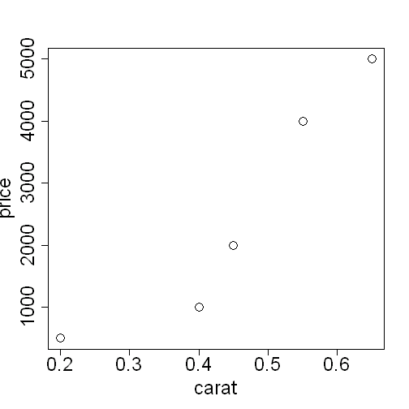
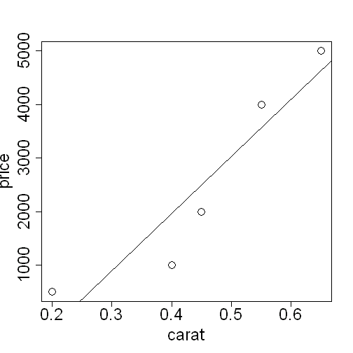
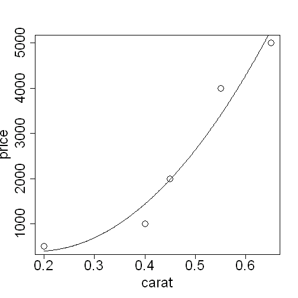

Learning R, Part 1
========================================================
author: Nathan Byers
date: April 21, 2014

Topics
========================================================

- R basics
- Doing a simple regression
- Web scraping
- Brief discussion of using R with other languages/programs

What is R?
========================================================
#incremental: true
- R is a free, open-source language and environment for statistical analysis
- It's been very popular in academia for more than a decade
- R is becoming more popular in industry, <a href="http://www.kdnuggets.com/2013/06/kdnuggets-annual-software-poll-rapidminer-r-vie-for-first-place.html" target="_blank"> particularly for data mining</a>

Starting Up R
========================================================
We'll be opening up an R session through IUanyWARE:  

1. In Go to <a href="https://iuanyware.iu.edu" target="_blank"> iuanyware.iu.edu</a> and sign in
2. Go to the Analysis & Modeling folder
3. Open RStudio (say no to the update request)


Doing math
========================================================

- Open up a script by going to File -> New File -> R Script 
- It will be the top left panel in RStudio
- Try some math


```r
10 + 5
10 - 5
10 * 5
10 / 5
```


- All the code in this presentation can be copied and pasted into your script
- Highlight your code and click the "Run" button on the toolbar of the script panel

Creating a variable
========================================================
The assignment operator in R is `<-`


```r
x <- 10
y <- 5
x + y
```

```
[1] 15
```


(the top panel shows what you should run in your script and the bottom panel shows the output)

Vectors
========================================================
- Vectors are variables with an ordered set of values
- We use `c( )` as a container for vectors


```r
x <- c(1, 2, 3, 4, 5)
x
```

```
[1] 1 2 3 4 5
```


Data frames
========================================================
- Data frames are spreadsheet-like tables in R
- We use the `data.frame(variable1, variable2, ...)` function

```r
price <- c(1000, 4000, 2000, 5000, 500)
carat <- c(0.4, 0.55, 0.45, 0.65, .2)
color <- c("G", "H", "D", "E", "G")
diamonds <- data.frame(price, carat, color)
diamonds
```

```
  price carat color
1  1000  0.40     G
2  4000  0.55     H
3  2000  0.45     D
4  5000  0.65     E
5   500  0.20     G
```


Plotting 
========================================================
`plot(x = carat, y = price)`

 


Regression
========================================================
We use the `lm(y ~ x)` function in R to fit 
a linear regression model and the `summary( )`
function to see the results


```r
fit <- lm(price ~ carat)
summary(fit)
```


Regression (output)
=========================================================

```

Call:
lm(formula = price ~ carat)

Residuals:
   1    2    3    4    5 
-967  435 -500  370  663 

Coefficients:
            Estimate Std. Error t value Pr(>|t|)  
(Intercept)    -2294       1129   -2.03    0.135  
carat          10652       2378    4.48    0.021 *
---
Signif. codes:  0 '***' 0.001 '**' 0.01 '*' 0.05 '.' 0.1 ' ' 1

Residual standard error: 806 on 3 degrees of freedom
Multiple R-squared:  0.87,	Adjusted R-squared:  0.827 
F-statistic: 20.1 on 1 and 3 DF,  p-value: 0.0207
```


Regression
=========================================================
Let's see what this regression looks like as a line on our plot

```r
plot(carat, price)
abline(fit)
```


 


Regression
========================================================
- Looking at the graph, we might think a quadratic model would work better
- This just means that we add squared values of the `carat` variable

```r
carat2 <- carat^2
fit2 <- lm(price ~ carat + carat2)
summary(fit2)
```


Regression (quadratic output)
=========================================================

```

Call:
lm(formula = price ~ carat + carat2)

Residuals:
     1      2      3      4      5 
-437.4  596.0   20.2 -280.4  101.6 

Coefficients:
            Estimate Std. Error t value Pr(>|t|)
(Intercept)     1169       1877    0.62     0.60
carat          -8375       9502   -0.88     0.47
carat2         22616      11120    2.03     0.18

Residual standard error: 564 on 2 degrees of freedom
Multiple R-squared:  0.958,	Adjusted R-squared:  0.915 
F-statistic: 22.6 on 2 and 2 DF,  p-value: 0.0424
```


Plot (quadratic)
=========================================================

 


Web scraping
=========================================================

- R is not just a language for statistics
- It's an environment for retrieving and manipulating data
- For example, scraping the web for data is very easy

Web scraping
=========================================================

- Let's look at the <a href="http://en.wikipedia.org/wiki/Healthcare_system" target="_blank"> Wikipedia page on healthcare systems</a>
- Our goal is to scrape the first table


Web scraping
=========================================================

For this example we use the `XML` package


```r
install.packages("XML")
library(XML)
url <- "http://en.wikipedia.org/wiki/Healthcare_system"
table <- readHTMLTable(url)[[1]]
View(table)
```


```
    Country Life expectancy Infant mortality
1 Australia            81.4             4.49
2    Canada            81.4             4.78
3    France            81.0             3.34
4   Germany            79.8             3.48
5     Italy            80.5             3.33
```


R packages
========================================================

- A quick word on what an "R package" is
- R comes with core, or base, functionality
- However, anyone can write functions for R and make it available to other R users in a package
- Packages must be installed first (the `install.packages()` function) then loaded before using it (the `library()` function)

Combining R with other tools
========================================================

- R is a high level language, so it's easier to use but sometimes slow
- The <a href="http://dirk.eddelbuettel.com/code/rcpp.html" target="_blank">Rcpp package</a> enables you to write code in C++ for speedy processing and integrate that code with R


Combining R with other tools
========================================================

- R can also <a href="http://www.statmethods.net/input/dbinterface.html" target="_blank">connect to databases</a>
- And work with data files from <a href="http://cran.r-project.org/doc/manuals/r-devel/R-data.html#Importing-from-other-statistical-systems" target="_blank">other stats programs</a>
- It can also be used with <a href="http://blog.revolutionanalytics.com/2011/09/mapreduce-hadoop-r.html" target="_blank">Hadoop</a> for big data analytics


Resources for learning R
========================================================

- UCLA has a great <a href="http://www.ats.ucla.edu/stat/r/" target="_blank">website</a> for learning R and statistics
- There are many good books as well, such as
 - <a href="http://www.amazon.com/Beginners-Guide-Use-Alain-Zuur/dp/0387938362/ref=sr_1_1?ie=UTF8&qid=1397750360&sr=8-1&keywords=beginner%27s+guide+to+R" target="_blank">Zuur et al.'s</a>
 - <a href="http://www.amazon.com/Introductory-Statistics-R-Computing/dp/0387790535/ref=sr_1_1?ie=UTF8&qid=1397750420&sr=8-1&keywords=introductory+statistics+R" target="_blank">Dalgaard's</a>
 - and <a href="http://www.amazon.com/Introductory-Beginners-Guide-Visualisation-Analysis-ebook/dp/B00BU34QTM/ref=sr_1_1?ie=UTF8&qid=1397750458&sr=8-1&keywords=introductory+R" target="_blank">Knell's</a>
- And remember, R can be freely <a href="http://www.r-project.org/" target="_blank">downloaded</a> and works on most operating systems


Part 2
======================================================
- Part 2 of this series can be found here: <a href="http://rpubs.com/NateByers/introR2" target="_blank"> rpubs.com/NateByers/introR2</a> 
- These presentations were created using RStudio's <a href="http://www.rstudio.com/ide/docs/presentations/overview?version=0.98.501&mode=desktop" target="_blank">"R Presentations"</a>
- RStudio can also be freely <a href="http://www.rstudio.com/" target="_blank">downloaded</a>
- The code for this presentation can be found here:<a href="https://github.com/NateByers/IntroRpresentation/tree/master" target="_blank"> github.com/NateByers/IntroRpresentation/tree/master</a>
